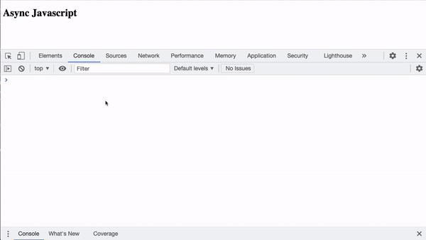
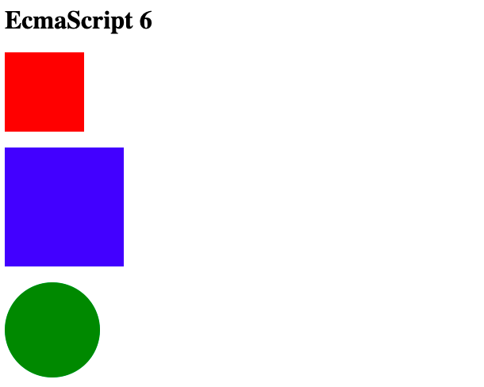
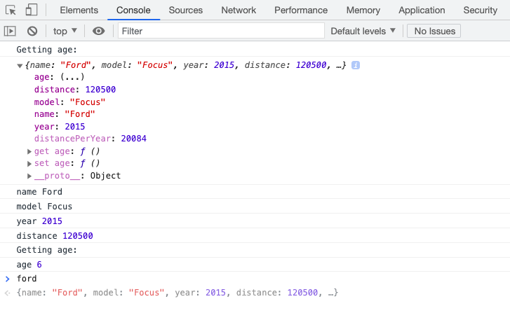

# js-practice

## 4. Callback vs Promise
implement
``` 
Client -> Server -> DataBase -> Server -> Client
```

### Callback approach
```JS
console.log('Client: I want to get a list of users')
console.log('...')

setTimeout(function() {
  console.log('Сервер: запрашиваю список пользователей в БД')
  console.log('...')

  setTimeout(function() {
    console.log('Server: requesting a list of users in the database')
    console.log('...')

    setTimeout(function() {
      console.log('Server: transforming data for the client')
      console.log('...')

      setTimeout(function() {
        console.log('Client: received data and display it')
      }, 1000)
    }, 500)
  }, 500)
}, 1000)
```

### Promise approach
```JS
console.log('Client: I want to get a list of users')
console.log('...')

var promise = new Promise(function(resolve, reject) {
  setTimeout(function() {
    console.log('Server: requesting a list of users in the database')
    console.log('...')
    resolve()
  }, 1000)
})

promise.then(function() {
  return new Promise(function(resolve, reject) {
    setTimeout(function() {
      var users = [
        {uid: 'id1', name: 'Peter'},
        {uid: 'id2', name: 'Simon'}
      ]
      // reject('DB could not get the list of users')
      console.log('DB: form a list of users', users)
      console.log('...')
      resolve(users)
    }, 500)
  })
})
.then(function(dbUsers) {
  return new Promise(function(resolve, reject) {
    setTimeout(function() {
      console.log('Server: transforming data for the client')
      console.log('...')
      var users = dbUsers.map(function(user) {
        return {
          id: user.uid,
          firstName: user.name,
          timestamp: Date.now()
        }
      })
      resolve(users)
    }, 500)
  })
})
.then(function(users) {
  setTimeout(function() {
    console.log('Client: received data and display it', users)
  }, 1000)
})
.catch(function(error) {
  console.error(error)
})
// .finally(function() {
//   console.log('Finally')
// })
```



## 3. Classes and inheritance
```JS
// RootElement <= Box <= instances

class RootElement {
  constructor(tagName = 'div') {
    this.$el = document.createElement(tagName)
    this.$el.style.marginBottom = '20px'
  }

  hide() {
    this.$el.style.opacity = '0'
  }

  show() {
    this.$el.style.opacity = '1'
  }

  append() {
    document.querySelector('.wrapper').insertAdjacentElement('beforeend', this.$el)
  }
}

class Box extends RootElement {
  constructor(color, size = 150, tagName) {
    super(tagName)
    this.color = color
    this.size = size
  }

  create() {
    this.$el.style.background = this.color
    this.$el.style.width = this.$el.style.height = `${this.size}px`

    this.append()

    return this
  }
}

class Circle extends RootElement {
  constructor(color) {
    super()

    this.color = color
  }

  create() {
    this.$el.style.borderRadius = '50%'
    this.$el.style.width = this.$el.style.height = `120px`
    this.$el.style.background = this.color

    this.append()

    return this
  }
}

const redBox = new Box('red', 100, 'div').create()
const blueBox = new Box('blue').create()

const circle = new Circle('green').create()

circle.$el.addEventListener('mouseenter', () => {
  circle.hide()
})

circle.$el.addEventListener('mouseleave', () => {
  circle.show()
})
```



## 2. Define a method for all arrays (using the prototype)
```JS
var a = [1, 2, 3]
var b = [5, 'Hello', 6]

Array.prototype.double = function() {
  var newArray = this.map(function(item) {
    if (typeof item === 'number') {
      return Math.pow(item, 2)
    }

    if (typeof item === 'string') {
      return item += item
    }
  })

  return newArray
}

var newA = a.double()
var newB = b.double()

console.log('A', newA.double())
console.log('B', newB)
````


## 1. Creating and configuring an object

https://developer.mozilla.org/ru/docs/Web/JavaScript/Reference/Global_Objects/Object/getOwnPropertyDescriptor

