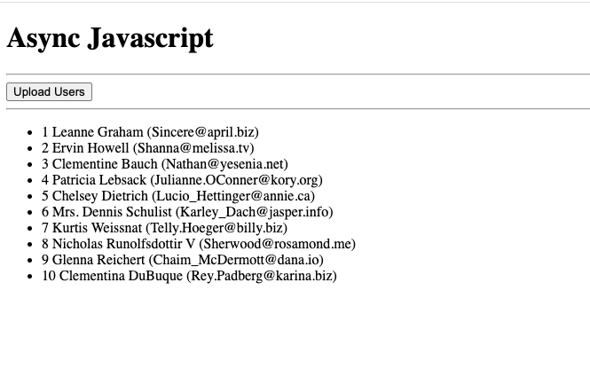

# js-practice

## 6. Implement MyPromise class, which works as Promise.
```JS
class myPromise {
    // implementing the constructor we know that we get some callback
    constructor(callback) {
        this.onCatch = null;
        this.onFinally = null;
        this.thenCbs = [];
        this.isRejected = false;

        function resolver(data) {
            if (this.isRejected) {
                return;
            }
            // here we have to figure out how to call the then's chain
            this.thenCbs.forEach(cb => {
                data = cb(data);
            });

            if (this.onFinally) {
                this.onFinally();
            }
        }

        function rejecter(error) {
            this.isRejected = true;
            // when we call this method, we create an error that should get into the method catch()
            // we will find out if we already have processing catch()
            if (this.onCatch) {
                // method catch() has already been saved in onCatch var 
                this.onCatch(error);
            }

            if (this.onFinally) {
                this.onFinally();
            }
        }

        callback(resolver.bind(this), rejecter.bind(this));
    }

    // can be called an infinite number of times
    then(cb) {
        // add our callbacks to an array
        this.thenCbs.push(cb);
        // to continue the chain
        return this;
    }

    // we can call this method only 1 time (cause the error is processed only once)
    catch(cb) {
        // that's how we will remember this callback (cb)
        this.onCatch = cb;
        return this;
    }

    // also called only 1 time
    finally (cb) {
        // that's how we will remember this callback (cb)
        this.onFinally = cb;
        return this;

    }
}

// test our functionality
const promise = new myPromise((resolve, reject) => {
    setTimeout(() => {
        // reject('Some error');
        resolve(10);
    }, 2000);
});

promise
    .then(num => num *= 2)
    .catch(err => console.error(err))
    .then(num => num *= 3)
    .finally(() => console.log('finally'))
    .then(num => console.log('Done', num));

// Result:
// >Done 60
// >finally
```

## 5. Upload users with fetch()

Upload a list of users from the server (mock data from https://jsonplaceholder.typicode.com/users)

### Promise approach
```JS
function load() {
  var url = 'https://jsonplaceholder.typicode.com/users'
  
  fetch(url)
    .then(function(response) {
      return response.json()
    })
    .then(function(data) {
      var ul = document.querySelector('#list')

      var html = data.map(function(item) {
        return '<li>' + item.id + ' ' + item.name + ' (' + item.email + ')</li>'
      })
      
      ul.insertAdjacentHTML('afterbegin', html.join(' '))
    })
}
```

### Async Await approach
```JS
document.querySelector('#load').addEventListener('click', load)

async function load() {
  var url = 'https://jsonplaceholder.typicode.com/users'

  var response = await fetch(url)
  var data = await response.json()

  var ul = document.querySelector('#list')

  var html = data.map(function(item) {
    return '<li>' + item.id + ' ' + item.name + ' (' + item.email + ')</li>'
  })
  
  ul.insertAdjacentHTML('afterbegin', html.join(' '))
}
```


## 4. Callback vs Promise
implement
``` 
Client -> Server -> DataBase -> Server -> Client
```

### Callback approach
```JS
console.log('Client: I want to get a list of users')
console.log('...')

setTimeout(function() {
  console.log('Server: requesting a list of users in the database')
  console.log('...')

  setTimeout(function() {
    console.log('Server: requesting a list of users in the database')
    console.log('...')

    setTimeout(function() {
      console.log('Server: transforming data for the client')
      console.log('...')

      setTimeout(function() {
        console.log('Client: received data and display it')
      }, 1000)
    }, 500)
  }, 500)
}, 1000)
```

### Promise approach
```JS
console.log('Client: I want to get a list of users')
console.log('...')

var promise = new Promise(function(resolve, reject) {
  setTimeout(function() {
    console.log('Server: requesting a list of users in the database')
    console.log('...')
    resolve()
  }, 1000)
})

promise.then(function() {
  return new Promise(function(resolve, reject) {
    setTimeout(function() {
      var users = [
        {uid: 'id1', name: 'Peter'},
        {uid: 'id2', name: 'Simon'}
      ]
      // reject('DB could not get the list of users')
      console.log('DB: form a list of users', users)
      console.log('...')
      resolve(users)
    }, 500)
  })
})
.then(function(dbUsers) {
  return new Promise(function(resolve, reject) {
    setTimeout(function() {
      console.log('Server: transforming data for the client')
      console.log('...')
      var users = dbUsers.map(function(user) {
        return {
          id: user.uid,
          firstName: user.name,
          timestamp: Date.now()
        }
      })
      resolve(users)
    }, 500)
  })
})
.then(function(users) {
  setTimeout(function() {
    console.log('Client: received data and display it', users)
  }, 1000)
})
.catch(function(error) {
  console.error(error)
})
// .finally(function() {
//   console.log('Finally')
// })
```


## 3. Classes and inheritance
```JS
// RootElement <= Box <= instances

class RootElement {
  constructor(tagName = 'div') {
    this.$el = document.createElement(tagName)
    this.$el.style.marginBottom = '20px'
  }

  hide() {
    this.$el.style.opacity = '0'
  }

  show() {
    this.$el.style.opacity = '1'
  }

  append() {
    document.querySelector('.wrapper').insertAdjacentElement('beforeend', this.$el)
  }
}

class Box extends RootElement {
  constructor(color, size = 150, tagName) {
    super(tagName)
    this.color = color
    this.size = size
  }

  create() {
    this.$el.style.background = this.color
    this.$el.style.width = this.$el.style.height = `${this.size}px`

    this.append()

    return this
  }
}

class Circle extends RootElement {
  constructor(color) {
    super()

    this.color = color
  }

  create() {
    this.$el.style.borderRadius = '50%'
    this.$el.style.width = this.$el.style.height = `120px`
    this.$el.style.background = this.color

    this.append()

    return this
  }
}

const redBox = new Box('red', 100, 'div').create()
const blueBox = new Box('blue').create()

const circle = new Circle('green').create()

circle.$el.addEventListener('mouseenter', () => {
  circle.hide()
})

circle.$el.addEventListener('mouseleave', () => {
  circle.show()
})
```


## 2. Define a method for all arrays (using the prototype)
```JS
var a = [1, 2, 3]
var b = [5, 'Hello', 6]

Array.prototype.double = function() {
  var newArray = this.map(function(item) {
    if (typeof item === 'number') {
      return Math.pow(item, 2)
    }

    if (typeof item === 'string') {
      return item += item
    }
  })

  return newArray
}

var newA = a.double()
var newB = b.double()

console.log('A', newA.double())
console.log('B', newB)
````


## 1. Creating and configuring an object

https://developer.mozilla.org/ru/docs/Web/JavaScript/Reference/Global_Objects/Object/getOwnPropertyDescriptor

